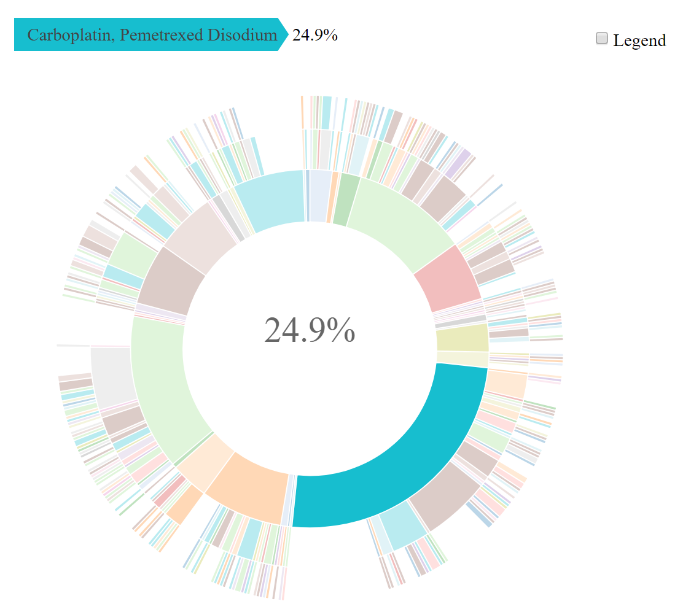

<!-- README.md is generated from README.Rmd. Please edit that file -->
<!-- badges: start -->

[](https://github.com/GENIE-BPC/genieBPC/actions)
[](https://codecov.io/gh/GENIE-BPC/genieBPC)

<!-- badges: end -->

# genieBPC </a>

The American Association for Cancer Research Project Genomics Evidence
Neoplasia Information Exchange Biopharma Collaborative (GENIE BPC) is an
effort to aggregate comprehensive clinical data linked to genomic
sequencing data to create a pan-cancer, publicly available data
repository. These data detail clinical characteristics and drug
treatment regimen information, along with high-throughput sequencing
data and clinical outcomes, for cancer patients across international
institutions. The GENIE BPC data repository forms a unique observational
database of comprehensive clinical annotation with molecularly
characterized tumors that can be used to advance precision medicine
research in oncology. Linking multiple clinical and genomic datasets
that vary in structure introduces an inherent complexity for data users.
Therefore, use of the GENIE BPC data requires a rigorous process for
preparing and merging the data to build analytic models. The {genieBPC}
package is a user-friendly data processing pipeline to streamline the
process for developing analytic cohorts that are ready for
clinico-genomic analyses.

## Installation

You can install the released version of {genieBPC} from the R Universe

``` r
install.packages('genieBPC', 
                 repos = c(mskccepibio = 'https://mskcc-epi-bio.r-universe.dev',
                           CRAN = 'https://cloud.r-project.org'))
```

and the development version with

``` r
remotes::install_github("GENIE-BPC/genieBPC")
```

## Overview of {genieBPC} Functions

-   **Data import:** `pull_data_synapse()` imports GENIE BPC data from
    Synapse into the R environment

-   **Data processing**

    -   `create_analytic_cohort()` selects an analytic cohort based on
        cancer diagnosis information and/or cancer-directed drug regimen
        information  
    -   `select_unique_ngs()` selects a unique next generation
        sequencing (NGS) test corresponding to the selected diagnoses

-   **Data visualization:** `drug_regimen_sunburst()` creates a sunburst
    figure of drug regimen information corresponding to the selected
    diagnoses in the order that the regimens were administered

## Obtaining Data Access

Access to the GENIE BPC data release folders on Synapse is required in
order to use this function. To obtain access:

*For public data releases:*

1.  Register for a [Synapse account](https://www.synapse.org/#)

2.  Navigate to the data release and request accept terms of use (e.g.,
    for the NSCLC 2.0-public data release, navigate to the [Synapse
    page](https://www.synapse.org/#!Synapse:syn27056697) for the data
    release). Towards the top of the page, there is information
    including the *Synapse ID*, *DOI*, *Item count*, and *Access.* Next
    to *Access* is a link that reads *Request Access*.

3.  Select *Request Access*, review the terms of data use and select
    *Accept*

*For consortium data releases (restricted to GENIE consortium members &
BPC pharmaceutical partners):*

1.  Register for a [Synapse account](https://www.synapse.org/#)

2.  Use [this link](https://www.synapse.org/#!Team:3399797) to access
    the GENIE BPC team list and request to join the team. Please include
    your full name and affiliation in the message before sending out the
    request.

3.  Once the request is accepted, you may access the data in the [GENIE
    Biopharma Collaborative
    projects](https://www.synapse.org/#!Synapse:syn21226493).

*Note: Please allow up to a week to review and grant access.*

## Analytic Data Guides

The analytic data guides provide details on each analytic dataset and
its corresponding variables for each data release.

**Public Data Releases**

-   [NSCLC v2.0-Public Analytic Data
    Guide](https://www.synapse.org/#!Synapse:syn30557304) *Released May
    2022*

**Consortium Data Releases**  
*Note that only GENIE BPC consortium users have access to the consortium
releases.*

-   [NSCLC v1.1-Consortium Analytic Data
    Guide](https://www.synapse.org/#!Synapse:syn23002641)

-   [NSCLC v2.1-Consortium Analytic Data
    Guide](https://www.synapse.org/#!Synapse:syn26008058)

-   [CRC v1.1-Consortium Analytic Data
    Guide](https://www.synapse.org/#!Synapse:syn23764204)

-   [CRC v1.2-Consortium Analytic Data
    Guide](https://www.synapse.org/#!Synapse:syn26077308)

-   [BrCa v1.1-Consortium Analytic Data
    Guide](https://www.synapse.org/#!Synapse:syn26077313)

## Example

The following example creates an analytic cohort of patients diagnosed
with Stage IV adenocarcinoma NSCLC.

*Pull data for NSCLC version 2.1-consortium:*

``` r
nsclc_2_1 <- pull_data_synapse(cohort = "NSCLC", version = "v2.1-consortium")
```

*Select stage IV adenocarcinoma NSCLC diagnoses:*

``` r
nsclc_stg_iv_adeno <- create_analytic_cohort(data_synapse = nsclc_2_1$NSCLC_v2.1, 
                                             stage_dx = "Stage IV", 
                                             histology = "Adenocarcinoma")
```

*Select one unique metastatic lung adenocarcinoma genomic sample per
patient in the analytic cohort returned above:*

``` r
nsclc_stg_iv_adeno_unique_sample <- select_unique_ngs(
  data_cohort = nsclc_stg_iv_adeno$cohort_ngs)
```

*Create a visualization of the treatment patterns for the first 3
regimens received by patients diagnosed with stage IV adenocarcinoma:*

``` r
sunplot <- drug_regimen_sunburst(data_synapse = nsclc_2_1$NSCLC_v2.1,
                                 data_cohort = nsclc_stg_iv_adeno,
                                 max_n_regimens = 3)
```

*Example of a sunburst plot showing 3 lines of treatment, Highlighting
First Treatment Regimen:*

# </a>
