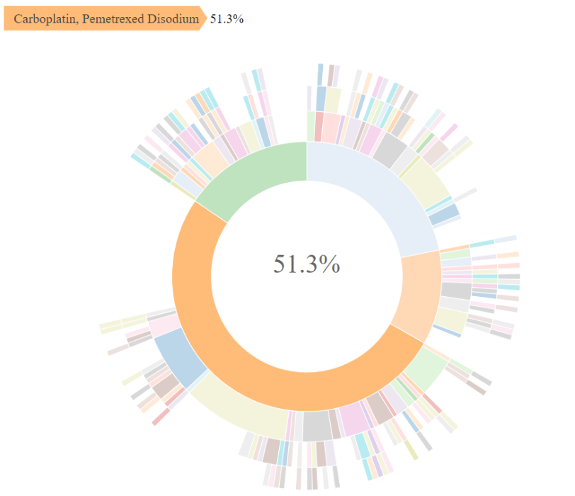

<!-- badges: start -->

<!-- badges: end -->

# genieBPC </a>

The American Association for Cancer Research Project Genomics Evidence
Neoplasia Information Exchange Biopharma Collaborative (GENIE BPC) is an
effort to aggregate comprehensive clinical data linked to genomic
sequencing data to create a pan-cancer, publicly available data
repository. These data detail clinical characteristics and drug
treatment regimen information, along with high-throughput sequencing
data and clinical outcomes, for cancer patients across international
institutions. The GENIE BPC data repository forms a unique observational
database of comprehensive clinical annotation with molecularly
characterized tumors that can be used to advance precision medicine
research in oncology. Linking multiple clinical and genomic datasets
that vary in structure introduces an inherent complexity for data users.
Therefore, use of the GENIE BPC data requires a rigorous process for
preparing and merging the data to build analytic models. The {genieBPC}
package is a user-friendly data processing pipeline to streamline the
process for developing analytic cohorts that are ready for
clinico-genomic analyses.

## Overview

-   **Data import:** `pull_data_synapse()` imports GENIE BPC data from
    Synapse into the R environment

-   **Data processing**

    -   `create_analytic_cohort()` selects an analytic cohort based on
        cancer diagnosis information and/or cancer-directed drug regimen
        information
    -   `select_unique_ngs()` selects a unique next generation
        sequencing (NGS) test corresponding to the selected diagnoses

-   **Data visualization:** `drug_regimen_sunburst()` creates a sunburst
    figure of drug regimen information corresponding to the selected
    diagnoses in the order that the regimens were administered

## Installation

You can install {genieBPC} with the following code:

    remotes::install_github("GENIE-BPC/genieBPC")

## Example

The following example creates an analytic cohort of patients diagnosed
with Stage IV adenocarcinoma NSCLC first treated with Carboplatin or
Cisplatin and Pemetrexed, with and without Bevacizumab,

*Pull data for NSCLC version 2.1:*

    nsclc_cohort <- pull_data_synapse(cohort = "NSCLC", version = "2.1")

*Select stage IV adenocarcinoma NSCLC diagnoses that were treated with
Carboplatin/Pemetrexed or Cisplatin/Pemetrexed with or without
Bevacizumab as the first regimen following diagnosis:*

    nsclc_stg_iv_adeno <- create_analytic_cohort(
      cohort = "NSCLC",
      data_synapse = nsclc_cohort,
      stage_dx = "Stage IV",
      histology = "Adenocarcinoma",
      regimen_drugs = c("Carboplatin, Pemetrexed Disodium",
                        "Cisplatin, Pemetrexed Disodium",
                        "Bevacizumab, Carboplatin, Pemetrexed Disodium",
                        "Bevacizumab, Cisplatin, Pemetrexed Disodium"),
      regimen_type = "Exact",
      regimen_order = 1,
      regimen_order_type = "within cancer",
      return_summary = FALSE
    )

*Select one unique metastatic lung adenocarcinoma genomic sample per
patient in the analytic cohort returned above:*

    nsclc_stg_iv_adeno_unique_sample <- select_unique_ngs( 
      data_cohort = nsclc_stg_iv_adeno$cohort_ngs, 
      oncotree_code = "LUAD",
      sample_type = "Metastasis"
    )

*Create a visualization of the treatment patterns for the first 4
regimens received by patients diagnosed with stage IV adenocarcinoma
NSCLC that were treated with Carboplatin/Pemetrexed or
Cisplatin/Pemetrexed with or without Bevacizumab as the first regimen
following diagnosis:*

    sunplot <- drug_regimen_sunburst(data_synapse = nsclc_cohort,
                                 data_cohort = nsclc_stg_iv_adeno,
                                 max_n_regimens = 4)

*Example of a sunburst plot showing 4 lines of treatment, Highlighting
First Treatment Regimen:*

# </a>

## Obtaining Access to GENIE BPC Data

Access to the GENIE BPC data release folders on Synapse is required in
order to use this function. To obtain access:

1.  Register for a [Synapse account](https://www.synapse.org/#)

2.  Use [this link](https://www.synapse.org/#!Team:3399797) to access
    the GENIE BPC team list and request to join the team. Please include
    your full name and affiliation in the message before sending out the
    request.

3.  Once the request is accepted, you may access the data in the [GENIE
    Biopharma collaborative
    projects](https://www.synapse.org/#!Synapse:syn21226493).

*Note: Please allow up to a week to review and grant access.*

## Analytic Data Guides

Documentation corresponding to the clinical data files can be found on
Synapse in the Analytic Data Guides:

-   [NSCLC V1.1 Analytic Data
    Guide](https://www.synapse.org/#!Synapse:syn23002641)
-   [NSCLC V2.1 Analytic Data
    Guide](https://www.synapse.org/#!Synapse:syn26008058)
-   [CRC V1.1 Analytic Data
    Guide](https://www.synapse.org/#!Synapse:syn23764204)
-   [CRC V1.2 Analytic Data
    Guide](https://www.synapse.org/#!Synapse:syn26077308)
-   [BrCa V1.1 Analytic Data
    Guide](https://www.synapse.org/#!Synapse:syn26077313)
