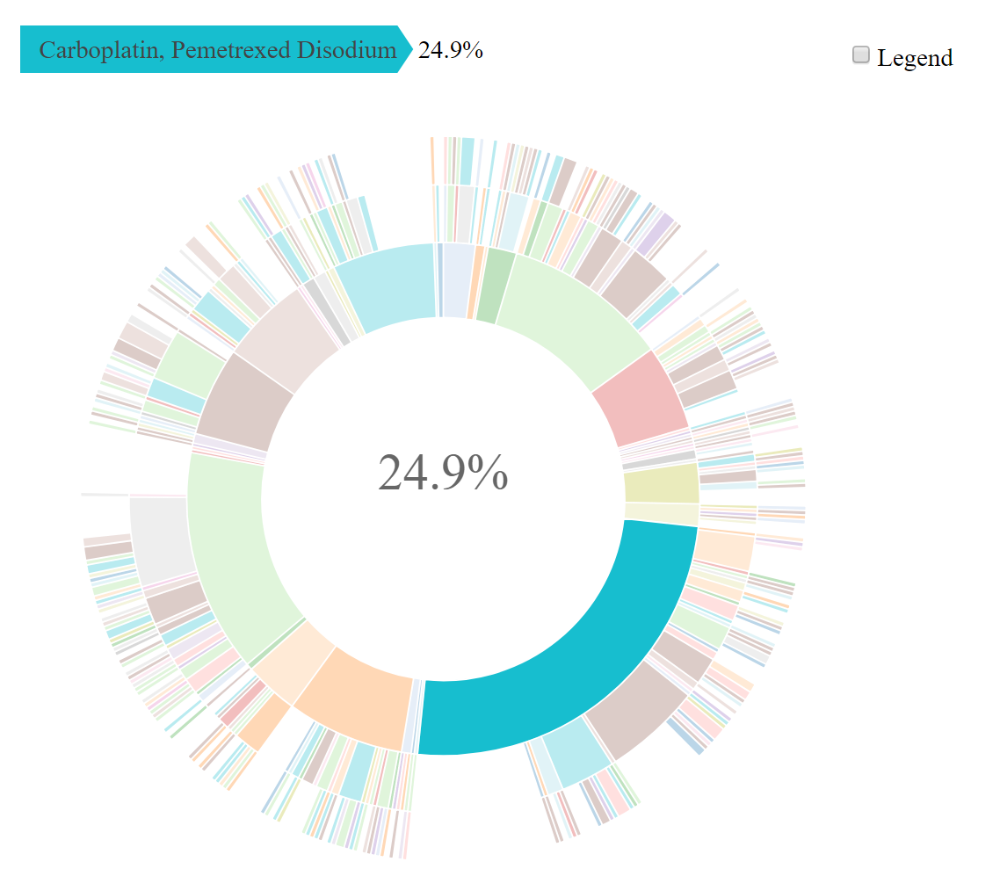

# genieBPC 

The American Association for Cancer Research Project Genomics Evidence
Neoplasia Information Exchange Biopharma Collaborative (GENIE BPC) is an
effort to aggregate comprehensive clinical data linked to genomic
sequencing data to create a pan-cancer, publicly available data
repository. These data detail clinical characteristics and drug regimen
treatment information, along with high-throughput sequencing data and
clinical outcomes, for cancer patients across multiple institutions. The
GENIE BPC data repository forms a unique observational database of
comprehensive clinical annotation with molecularly characterized tumors
that can be used to advance precision medicine research in oncology.
Linking multiple clinical and genomic datasets that vary in structure
introduces an inherent complexity for data users. Therefore, use of the
GENIE BPC data requires a rigorous process for preparing and merging the
data to build analytic models. The {genieBPC} package is a user-friendly
data processing pipeline to streamline the process for developing
analytic cohorts that are ready for clinico-genomic analyses.

## Installation

Install {genieBPC} from CRAN:

``` r
install.packages("genieBPC")
```

Install the development version of {genieBPC} with:

``` r
remotes::install_github("GENIE-BPC/genieBPC")
```

## Overview of {genieBPC} Functions

- **Data import:**
  [`pull_data_synapse()`](https://genie-bpc.github.io/genieBPC/reference/pull_data_synapse.md)
  imports GENIE BPC data from ‘Synapse’ into the R environment

- **Data processing**

  - [`create_analytic_cohort()`](https://genie-bpc.github.io/genieBPC/reference/create_analytic_cohort.md)
    selects an analytic cohort based on cancer diagnosis information
    and/or cancer-directed drug regimen information  
  - [`select_unique_ngs()`](https://genie-bpc.github.io/genieBPC/reference/select_unique_ngs.md)
    selects a unique next generation sequencing (NGS) test corresponding
    to the selected diagnoses

- **Data visualization:**
  [`drug_regimen_sunburst()`](https://genie-bpc.github.io/genieBPC/reference/drug_regimen_sunburst.md)
  creates a sunburst figure of drug regimen information corresponding to
  the selected diagnoses in the order that the regimens were
  administered

## Data Access & Authentication

Access to the GENIE BPC data release folders on ‘Synapse’ is required in
order to use this function. To obtain access:

***For public data releases:***

1.  Register for a [‘Synapse’ account](https://www.synapse.org/#). Be
    sure to create a username and password. *Note: do NOT connect via
    your Google account.*

2.  Accept the **Synapse account terms of use.**

3.  Navigate to [GENIE Biopharma Collaborative Public
    page](https://www.synapse.org/Synapse:syn27056172/wiki/616601).

4.  In the Files folder, navigate to Data Releases and click on the
    cancer cohort and data release version of choice.

5.  Select *Request Access*, **review the terms of data use,** and
    select *Accept.*

***For consortium data releases (restricted to GENIE consortium members
& BPC pharmaceutical partners):***

1.  Register for a [‘Synapse’ account](https://www.synapse.org/#). Be
    sure to create a username and password. *Note: do NOT connect via
    your Google account.*

2.  Accept the **Synapse account terms of use.**

3.  Use [this link](https://www.synapse.org/#!Team:3399797) to access
    the GENIE BPC team list and request to join the team. Please include
    your full name and affiliation in the message before sending out the
    request. *(Note: Please allow up to a week to review and grant
    access.)*

4.  Once the request is accepted, you may access the data in the [GENIE
    Biopharma Collaborative
    projects](https://www.synapse.org/#!Synapse:syn21226493).

5.  In the Files folder, navigate to Data Releases and click on the
    cancer cohort and data release version of choice.

6.  Select *Request Access*, **review the terms of data use,** and
    select *Accept.*

*Note: permissions for Synapse and permissions for each data release are
distinct. Both permissions must be accepted to successfully access the
data.*

***Request a Synapse Personal Access Token (PAT):***

Once you are logged into your Synapse account, you may request a Synapse
personal access token (PAT).

1.  In the left hand panel towards the bottom, click the button that
    shows the first letter of your first name. This button displays the
    text “Your Account” when hovered over and appears directly above the
    question mark button.

2.  Next, select *Account Settings* and then scroll to the bottom of the
    page.

3.  Under the “Personal Access Tokens” section, select *Manage Personal
    Access Tokens.*

4.  On the “Personal Access Tokens” page, click on *Create New Token* to
    generate a Synapse Personal Access Token.

5.  Specify a Token Name and click the checkbox that will allow you to
    *Download* the data, and then select *Create Token.*

6.  Save your Synapse Personal Access Token in a secure location.

***Authenticate yourself***

Whether you are using public or consortium data, you will need to
authenticate yourself at the beginning of each R session in which you
use {genieBPC} to pull data (see
[`set_synapse_credentials()`](https://genie-bpc.github.io/genieBPC/reference/set_synapse_credentials.md)),
or store your credentials as environmental variables. See [Tutorial:
pull_data_synapse](https://genie-bpc.github.io/genieBPC/articles/pull_data_synapse_vignette.html)
for more details.

## Analytic Data Guides

The analytic data guides provide details on each analytic dataset and
its corresponding variables for each data release.

**Public Data Releases**

- [NSCLC v2.0-Public Analytic Data
  Guide](https://www.synapse.org/#!Synapse:syn30557304) *Released May
  2022*

- [CRC v2.0-Public Analytic Data
  Guide](https://www.synapse.org/#!Synapse:syn31751466) *Released August
  2022*

**Consortium Data Releases**  
*Note that only GENIE BPC consortium users have access to the consortium
releases.*

- [NSCLC v1.1-Consortium Analytic Data
  Guide](https://www.synapse.org/#!Synapse:syn23002641)

- [NSCLC v2.2-Consortium Analytic Data
  Guide](https://www.synapse.org/#!Synapse:syn53463493)

- [NSCLC v3.1-Consortium Analytic Data
  Guide](https://www.synapse.org/#!Synapse:syn58597690)

- [CRC v1.3-Consortium Analytic Data
  Guide](https://www.synapse.org/#!Synapse:syn53463650)

- [BrCa v1.1-Consortium Analytic Data
  Guide](https://www.synapse.org/#!Synapse:syn26077313)

- [BrCa v1.2-Consortium Analytic Data
  Guide](https://www.synapse.org/#!Synapse:syn32330194)

- [PANC v1.1-Consortium Analytic Data
  Guide](https://www.synapse.org/#!Synapse:syn29787285)

- [PANC v1.2-Consortium Analytic Data
  Guide](https://www.synapse.org/#!Synapse:syn50612821)

- [BLADDER v1.1-Consortium Analytic Data
  Guide](https://www.synapse.org/#!Synapse:syn30787692)

- [BLADDER v1.2-Consortium Analytic Data
  Guide](https://www.synapse.org/#!Synapse:syn53018714)

- [Prostate v1.1-Consortium Analytic Data
  Guide](https://www.synapse.org/#!Synapse:syn30148714)

- [Prostate v1.2-Consortium Analytic Data
  Guide](https://www.synapse.org/#!Synapse:syn50612204)

## Example

The following example creates an analytic cohort of patients diagnosed
with Stage IV adenocarcinoma NSCLC.

*Pull data for NSCLC version 2.0-public:*

``` r
nsclc_2_0 <- pull_data_synapse(cohort = "NSCLC", version = "v2.0-public")
```

*Select stage IV adenocarcinoma NSCLC diagnoses:*

``` r
nsclc_stg_iv_adeno <- create_analytic_cohort(data_synapse = nsclc_2_0$NSCLC_v2.0, 
                                             stage_dx = "Stage IV", 
                                             histology = "Adenocarcinoma")
```

*Select one unique metastatic lung adenocarcinoma genomic sample per
patient in the analytic cohort returned above:*

``` r
nsclc_stg_iv_adeno_unique_sample <- select_unique_ngs(
  data_cohort = nsclc_stg_iv_adeno$cohort_ngs)
```

*Create a visualization of the treatment patterns for the first 3
regimens received by patients diagnosed with stage IV adenocarcinoma:*

``` r
sunplot <- drug_regimen_sunburst(data_synapse = nsclc_2_0$NSCLC_v2.0,
                                 data_cohort = nsclc_stg_iv_adeno,
                                 max_n_regimens = 3)
```

*Example of a sunburst plot showing 3 treatment regimens, highlighting
the first treatment regimen:*

# 

## GENIE BPC Publications

Lavery JA, Brown S, Curry MA, Martin A, Sjoberg DD, Whiting K. [A data
processing pipeline for the AACR project GENIE biopharma collaborative
data with the {genieBPC} R
package](https://academic.oup.com/bioinformatics/article/39/1/btac796/6909009)
Bioinformatics. Volume 39, Issue 1. 2023 Jan; doi:
10.1093/bioinformatics/btac796

**Methodological Papers**

Kehl KL, Lavery JA, Brown S, Fuchs H, Riely G, Schrag D, Newcomb A,
Nichols C, Micheel CM, Bedard PL, Sweeney SM, Fiandalo M, Panageas KS;
AACR Project GENIE BPC Core Team. [Biomarker Inference and the Timing of
Next-Generation Sequencing in a Multi-Institutional, Cross-Cancer
Clinicogenomic Data Set](https://pubmed.ncbi.nlm.nih.gov/38484212/). JCO
Precis Oncol. 2024 Mar;8:e2300489. doi: 10.1200/PO.23.00489. PMID:
38484212; PMCID: PMC10954072.

Kehl KL, Uno H, Gusev A, Groha S, Brown S, Lavery JA, Schrag D, Panageas
KS. [Elucidating Analytic Bias Due to Informative Cohort Entry in Cancer
Clinico-genomic Datasets](https://pubmed.ncbi.nlm.nih.gov/36626408/).
Cancer Epidemiol Biomarkers Prev. 2023 March; 32 (3): 344–352. doi:
10.1158/1055-9965.EPI-22-0875.

Brown S, Lavery JA, Shen R, Martin AS, Kehl KL, Sweeney SM, Lepisto EM,
Rizvi H, McCarthy CG, Schultz N, Warner JL, Park BH, Bedard PL, Riely
GJ, Schrag D, Panageas KS; AACR Project GENIE Consortium. [Implications
of Selection Bias Due to Delayed Study Entry in Clinical Genomic
Studies.](https://jamanetwork.com/journals/jamaoncology/fullarticle/2785693)
JAMA Oncol. 2022 Feb 1;8(2):287-291. doi: 10.1001/jamaoncol.2021.5153.
PMID: 34734967; PMCID: PMC9190030.

Kehl KL, Riely GJ, Lepisto EM, Lavery JA, Warner JL, LeNoue-Newton ML,
Sweeney SM, Rudolph JE, Brown S, Yu C, Bedard PL, Schrag D, Panageas KS;
American Association of Cancer Research (AACR) Project Genomics Evidence
Neoplasia Information Exchange (GENIE) Consortium. [Correlation Between
Surrogate End Points and Overall Survival in a Multi-institutional
Clinicogenomic Cohort of Patients With Non-Small Cell Lung or Colorectal
Cancer.](https://jamanetwork.com/journals/jamanetworkopen/fullarticle/2782339)
JAMA Netw Open. 2021 Jul 1;4(7):e2117547. doi:
10.1001/jamanetworkopen.2021.17547. PMID: 34309669; PMCID: PMC8314138.

Lavery JA, Lepisto EM, Brown S, Rizvi H, McCarthy C, LeNoue-Newton M, Yu
C, Lee J, Guo X, Yu T, Rudolph J, Sweeney S; AACR Project GENIE
Consortium, Park BH, Warner JL, Bedard PL, Riely G, Schrag D, Panageas
KS. [A Scalable Quality Assurance Process for Curating Oncology
Electronic Health Records: The Project GENIE Biopharma Collaborative
Approach.](https://doi.org/10.1200/CCI.21.00105) JCO Clin Cancer Inform.
2022 Feb; 6:e2100105. doi: 10.1200/CCI.21.00105. PMID: 35192403; PMCID:
PMC8863125.

**Clinical Papers**

Sanz-Garcia E, Brown S, Lavery JA, Weiss J, Fuchs HE, Newcomb A, Postle
A, Warner JL, LeNoue-Newton ML, Sweeney SM, Pillai S, Yu C, Nichols C,
Mastrogiacomo B, Kundra R, Schultz N, Kehl KL, Riely GJ, Schrag D,
Govindarajan A, Panageas KS, Bedard PL. [Genomic Characterization and
Clinical Outcomes of Patients with Peritoneal Metastases from the AACR
GENIE Biopharma Collaborative Colorectal Cancer
Registry](https://pubmed.ncbi.nlm.nih.gov/38329392/) Cancer Res Commun.
2024 Feb 20;4(2):475-486. doi: 10.1158/2767-9764.CRC-23-0409. PMID:
38329392; PMCID: PMC10876516.

Choudhury NJ, Lavery JA, Brown S, de Bruijn I, Jee J, Tran TN, Rizvi H,
Arbour KC, Whiting K, Shen R, Hellmann M, Bedard PL, Yu C, Leighl N,
LeNoue-Newton M, Micheel C, Warner JL, Ginsberg MS, Plodkowski A,
Girshman J, Sawan P, Pillai S, Sweeney SM, Kehl KL, Panageas KS, Schultz
N, Schrag D, Riely GJ. [The GENIE BPC NSCLC cohort: a real-world
repository integrating standardized clinical and genomic data for 1,846
patients with non-small cell lung
cancer](https://pubmed.ncbi.nlm.nih.gov/37223888/) Clin Cancer Res. 2023
May; doi: 10.1158/1078-0432.CCR-23-0580.
